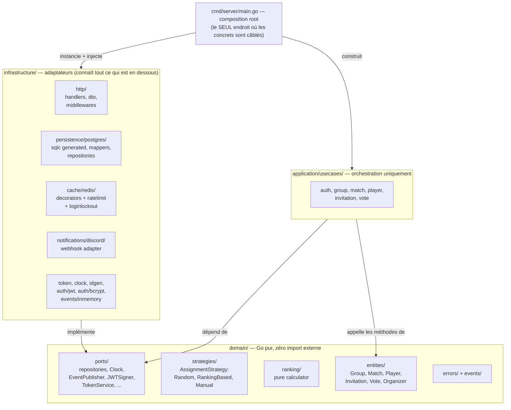
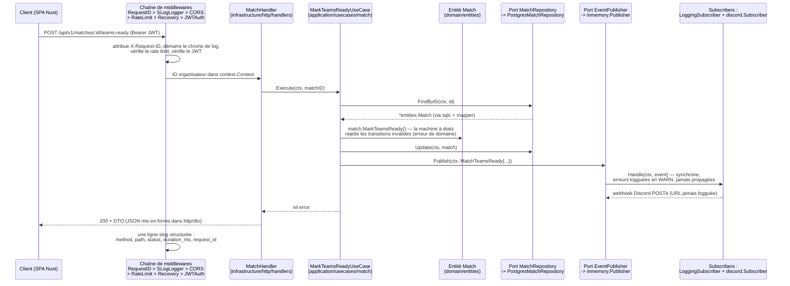

# Architecture de SMO — hexagonale (Ports & Adapters), telle que construite

Ce document explique l'architecture **de ce dépôt en particulier**, pas
l'architecture hexagonale en général. Chaque frontière de couche décrite ici
est imposée par le graphe d'imports réel et a été choisie pour une raison
énoncée.

## Pourquoi l'hexagonal, en un paragraphe

Le domaine de SMO (matchs, invitations, votes, classement) est la partie qui
a de la valeur à long terme ; Postgres, Gin, Redis et Discord sont des
détails remplaçables. L'architecture hexagonale rend cette priorité
structurelle : le domaine compile avec zéro import d'infrastructure, chaque
dépendance externe traverse une interface déclarée par le domaine, et tout le
câblage concret vit dans un seul fichier. Le gain est mesuré, pas
théorique — 86 % des 539 fonctions de test Go s'exécutent sans aucune E/S
(voir [docs/plans/2026-06-12-requirements-coverage.md](plans/2026-06-12-requirements-coverage.md),
ligne Tests), ce qui n'est possible que parce que les frontières sont
réelles.

## Les couches

Direction des dépendances : `infrastructure -> application -> domain`, et
`cmd/server` voit tout. Le domaine ne voit rien au-dessus de lui.

## Les quatre règles non négociables et où les vérifier

**Règle 1 — Le domaine ne sait rien de l'infrastructure.**
Aucun import `pgx`, `gin` ou `go-redis` n'existe sous `domain/` ; les entités
ne portent aucun tag JSON ou DB. Vérification :
`grep -rn "jackc\|gin-gonic\|go-redis" domain/` (ne renvoie rien). Même
`time.Now()` est banni du code domaine/application —
`domain/ports/clock.go` existe précisément pour cela.

**Règle 2 — Les ports dans le domaine, les implémentations dans
l'infrastructure.**
`domain/ports/` contient 13 fichiers de ports (six repositories, `Clock`,
`IDGenerator`, `EventPublisher`/`EventSubscriber`, `JWTSigner`,
`PasswordHasher`, `InvitationTokenService`, `LoginAttemptTracker`) ; chacun a
son adaptateur sous `infrastructure/`
(table de correspondance dans [design-patterns.md](design-patterns.md),
section 5). Les use cases importent uniquement `domain/ports`, jamais les
adaptateurs. Le câblage se fait exclusivement dans `cmd/server/main.go`
(`buildRouter`, lignes 215-392 — volontairement long et `//nolint:funlen`
avec une justification documentée aux lignes 206-214).

**Règle 3 — Les use cases orchestrent, ils ne portent pas la logique métier.**
Les règles métier vivent sur les entités : la machine à états des matchs est
dans `domain/entities/match_status.go` + `match_transitions.go` (transitions
strictes `draft -> open -> teams_ready -> in_progress -> completed ->
closed`) ; les requêtes d'appartenance à une équipe (`Match.TeamOf`,
`TeammatesOf`) sont des méthodes d'entité ajoutées pour l'ADR 0009 ; le
calcul du classement est la fonction pure `domain/ranking/calculator.go`. Un
use case comme `application/usecases/match/finalize_match.go` ne fait que
charger, appeler, persister et publier.

**Règle 4 — Pas d'interface sans justification.**
Chaque interface du code correspond à l'une des trois raisons autorisées
(fake de test / implémentations multiples / frontière de couche). L'inverse
est aussi respecté : les structs concrets sont utilisés directement quand
aucune raison ne s'applique (les use cases eux-mêmes sont des structs
concrets, les handlers les reçoivent comme dépendances concrètes). La
configuration Sonar encode même cette position : `sonar-project.properties`
accepte la règle `godre:S8196` pour les ports à méthode unique, avec la
justification écrite qu'il s'agit de "deliberately-named ports/markers
mandated by the hexagonal contract, not accidental header interfaces".

## Le compromis de pureté lié à sqlc

Le projet utilise sqlc (du Go typé généré à partir de SQL écrit à la main
dans `infrastructure/persistence/queries/`), qui produit ses propres structs
dans `infrastructure/persistence/postgres/generated/`. Deux familles de
structs existent donc pour chaque agrégat :

- l'entité de domaine pure (`domain/entities/group.go` — aucun tag,
  invariants imposés dans les constructeurs, ex. validation de l'URL de
  webhook conformément à l'ADR 0003), et
- le modèle de persistance (généré par sqlc, `emit_json_tags: false` dans
  `sqlc.yaml`, si bien que même les tags JSON n'y fuient pas).

Des mappers explicites dans `infrastructure/persistence/postgres/mappers/`
(`GroupToCreateParams`, `toDomain`, ...) convertissent entre les deux. **Le
coût est assumé** : environ le double de structs et du code de mapping à
maintenir. **Le bénéfice acheté** : les entités ne se plient jamais à la
forme de la base, les changements de schéma restent confinés dans
l'adaptateur, et CLAUDE.md qualifie ce compromis de "the main reason we chose
hexagonal over MVC for this project". La même discipline se répète à la
frontière HTTP : `infrastructure/http/dto/` possède toutes les formes JSON,
et un test de garde
(`TestGroupResponseFromEntity_NeverIncludesWebhookURL_InJSON`, ADR 0003 D4)
prouve une propriété de sécurité de cette couche de mapping.

Le code généré est exclu du lint (`.golangci.yml:124-129`), de la couverture
(`ci.yml:209`, `codecov.yml:39`) et de Sonar
(`sonar-project.properties:8`) — il n'est pas à nous de le couvrir, et le
masquer reviendrait à de la couverture cosmétique, ce que le projet refuse
explicitement (commentaires `ci.yml:230-236`).

## Une requête type, de bout en bout

Le flux ci-dessous est `POST /api/v1/matches/:id/teams-ready` (l'organisateur
marque les équipes comme prêtes), choisi parce qu'il traverse toutes les
coutures : auth, use case, machine à états de l'entité, repository,
événements, et deux subscribers.

Chemins d'échec à connaître pour une soutenance : une transition de statut
invalide renvoie une erreur de domaine typée (`domain/errors/errors.go`) que
le handler traduit en 4xx ; une panne de Discord ne fait jamais échouer la
requête (les erreurs des subscribers sont logguées et absorbées par
conception, ADR 0004) ; une panne de Redis dégrade le cache et le rate
limiter en pass-through avec des WARN throttlés
(`ratelimit/middleware.go:117-140`), jamais un 5xx.

## Où va chaque type de code (table de décision)

| Le code à écrire... | Va dans... | Preuve par l'exemple |
|---|---|---|
| Une règle métier / un invariant | `domain/entities/` (ou `strategies/`, `ranking/`) | machine à états des matchs, validation de l'URL de webhook |
| Une interface pour un besoin externe | `domain/ports/` | `InvitationTokenService` |
| L'orchestration d'une action utilisateur | `application/usecases/<area>/` | `respond_to_invitation.go` |
| Du SQL | `infrastructure/persistence/queries/*.sql` puis `sqlc generate` | `invitation.sql` |
| Une forme JSON de requête/réponse | `infrastructure/http/dto/` | `invitation_dto.go` |
| Une nouvelle réaction transverse à une transition | un subscriber dans `infrastructure/` + une ligne `Subscribe` dans `main.go` | `discord/subscriber.go` (ADR 0004) |
| Construction concrète / config | `cmd/server/main.go` uniquement | `buildRouter` |

> **MANQUE :** rien de structurel. Une dette documentaire : aucun diagramme
> d'architecture n'existe dans le README — les deux diagrammes mermaid
> ci-dessus devraient y être liés ou intégrés (suivi dans
> [docs/plans/2026-06-12-readme-punchlist.md](plans/2026-06-12-readme-punchlist.md)).
