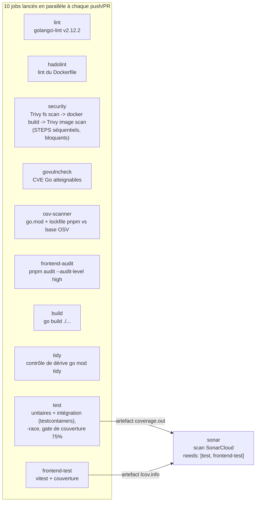

# Pipeline CI/CD — ce qui s'exécute réellement, et pourquoi

Source de vérité : `.github/workflows/ci.yml` (intégration continue) et
`.github/workflows/cd.yml` (livraison continue vers GHCR). Ce document décrit
les jobs tels qu'ils existent aujourd'hui, justifie chacun d'eux, et liste
honnêtement les manques face à la grille de notation.

## CI — déclenchement et forme

Déclencheurs : chaque push sur `main` et chaque pull request ciblant `main`
(`ci.yml:16-22`). Un groupe de concurrence annule les exécutions rendues
obsolètes sur la même ref (`ci.yml:23-25`) — aucune minute gaspillée sur les
PR force-pushées. Les permissions par défaut sont en lecture seule
(`permissions: contents: read`, lignes 26-27) ; seul le job `security` monte
à `security-events: write` pour l'upload SARIF.

### Graphe des jobs

### Chaque job, justifié

| Job (lignes) | Ce qu'il fait | Pourquoi il existe / logique du seuil |
|---|---|---|
| `lint` (29-42) | golangci-lint avec la configuration stricte du dépôt | 28 linters explicitement activés, chacun justifié dans `.golangci.yml` (voir [docs/plans/2026-06-12-requirements-coverage.md](plans/2026-06-12-requirements-coverage.md), point 3). Attrape les problèmes errcheck/gosec/complexité avant la revue. |
| `hadolint` (43-56) | Linte le Dockerfile | Une règle ignorée (DL3059) **avec une raison écrite dans le workflow** : les deux RUN `go build` restent séparés pour donner à buildx des couches de cache distinctes (binaire serveur vs binaire healthcheck). |
| `security` (57-110) | Trivy fs scan, puis build de l'image (`push: false, load: true`), puis Trivy image scan ; SARIF envoyé à GitHub Security dans les deux cas | Bloquant (`exit-code: '1'`) sur CRITICAL/HIGH. `limit-severities-for-sarif: true` est là parce que le format SARIF ignore sinon le filtre de sévérité et échoue sur LOW/MEDIUM (appris à nos dépens, commentaire aux lignes 74-76). Le fs scan et l'image scan sont deux surfaces d'attaque différentes : lockfiles vs couches finales/image de base. |
| `govulncheck` (111-126) | Scan de vulnérabilités Go avec analyse d'atteignabilité | Complète Trivy : ne signale que les CVE dont les symboles vulnérables sont réellement atteignables, "so a finding here is signal, never noise" (commentaire du workflow). Version pinnée, vérifiée via la base de checksums Go plutôt que par une action tierce. |
| `osv-scanner` (127-143) | Scanne go.mod + pnpm-lock.yaml contre la base OSV | Redondance délibérée : une base de vulnérabilités différente de celle de Trivy, compilée depuis les sources via le module proxy au lieu de tirer une action tierce de plus (posture supply chain). |
| `frontend-audit` (144-162) | `pnpm audit --audit-level high` à partir du seul lockfile | Aucune installation nécessaire ; seuil aligné sur le gate Trivy (high/critical). |
| `build` (163-176) | `go build ./cmd/server` + `go build ./...` | Contrôle de compilation fail-fast peu coûteux, indépendant des tests. |
| `tidy` (177-193) | `go mod tidy` puis `git diff --exit-code` | Garde go.mod/go.sum minimaux et honnêtes. S'exécute avec `GOFLAGS=-tags=integration` pour que les imports réservés à l'intégration ne soient pas élagués à tort. |
| `test` (194-261) | `go test -tags=integration -race -coverprofile=... ./...` puis un gate de couverture | Un seul job exécute les tests unitaires **et** d'intégration (testcontainers a besoin de Docker ; ubuntu-latest le fournit). Le périmètre de couverture n'exclut que les chemins réellement incouvrables (packages d'interfaces pures, code généré par sqlc), chaque exclusion justifiée en ligne (lignes 205-217). Gate à **75,0 %** (lignes 237-245), avec une politique écrite : "Raise it only after writing more tests; never lower it to make a regression pass". Upload vers Codecov (non bloquant en cas de panne Codecov, ligne 249) et stockage de `coverage.out` comme artefact pour Sonar. |
| `frontend-test` (262-286) | pnpm install (lockfile gelé) + vitest avec couverture | Artefact lcov pour Sonar. La règle Sonar S6505 suggère `--ignore-scripts` sur cet install : non appliqué, et c'est un choix. pnpm 10 (épinglé via `packageManager: pnpm@10.32.1`) bloque par défaut les scripts de cycle de vie des dépendances ; seule l'allowlist explicite `pnpm.onlyBuiltDependencies` (`@parcel/watcher`, `esbuild`) peut compiler, après revue. `--ignore-scripts` n'ajouterait rien contre la supply chain mais casserait notre propre `postinstall: nuxt prepare` et les deux builds approuvés. Le finding est marqué « Safe » dans SonarCloud avec cette justification. |
| `sonar` (287-313) | Scan SonarCloud, `needs: [test, frontend-test]` | Le seul job séquencé, parce qu'il ingère les deux artefacts de couverture. `fetch-depth: 0` pour l'attribution blame/new code. Action pinnée sur un SHA de commit complet (durcissement supply chain, le commentaire cite `githubactions:S7637`). |

### Pourquoi la séquence build -> docker build -> image scan est faite de steps, pas de `needs:`

La grille suggère une chaîne de jobs séquentielle via `needs:`. SMO
implémente le même ordonnancement **à l'intérieur du job `security`** (step
fs scan -> step `docker/build-push-action` -> step image scan,
`ci.yml:66-110`). Justification : passer une image fraîchement construite
entre jobs exige soit d'exporter/importer un artefact tarball de plusieurs
centaines de Mo, soit de pousser une image non vérifiée vers un registry
avant de la scanner ; des steps dans le même job donnent la garantie
d'ordonnancement identique avec zéro plomberie d'artefacts et un chemin
critique plus court. Compromis accepté : un échec du Trivy fs scan saute
aussi le build de l'image dans cette exécution (acceptable — le problème doit
de toute façon être corrigé d'abord).

> **MANQUE :** si l'évaluateur exige un graphe `needs:` littéral pour la
> chaîne de build, scinder `security` en `docker-build` (upload de l'image en
> artefact ou push d'un tag `:pr-scan`) et `trivy-image`
> (`needs: docker-build`). Coût : ~1-2 min par exécution et du YAML en plus ;
> bénéfice : un graphe plus lisible.

### Cache et artefacts

- Go : `actions/setup-go@v6` active par défaut le cache des modules et du
  build (clé sur `go.sum`), utilisé par les jobs
  lint/build/tidy/test/govulncheck/osv.
- Docker : le CD utilise le cache buildx GHA `cache-from/to:
  type=gha,mode=max` (`cd.yml:78-79`) — `mode=max` conserve les couches
  intermédiaires pour que la couche `go mod download` survive d'une exécution
  à l'autre (le commentaire dans cd.yml explique le plafond LRU de 10 Go).
- Artefacts : `go-coverage` et `frontend-coverage`, rétention 1 jour —
  consommés uniquement par `sonar` dans la même exécution.

### Ce qui bloque un merge

Tous les jobs de CI sont bloquants par code de sortie (lint, hadolint,
security, govulncheck, osv-scanner, frontend-audit, build, tidy, test y
compris le gate à 75 %, frontend-test, sonar). L'échec de l'upload Codecov
est explicitement non bloquant (`fail_ci_if_error: false` — une panne d'un
tiers n'est pas une régression de notre fait).

> **MANQUE :** le caractère *obligatoire* de ces checks (impossible de merger
> au rouge) est imposé dans les réglages de branch protection de GitHub, qui
> ne sont pas stockés dans le dépôt. Pour le rendu : capture d'écran de
> Settings > Branches montrant les checks requis et l'exigence d'historique
> linéaire.

## CD — ce qui existe aujourd'hui

`cd.yml` s'exécute à chaque push sur `main` (donc après chaque merge de PR)
et fait exactement une chose : construire une image **multi-arch**
(linux/amd64 + linux/arm64) et la pousser vers `ghcr.io/ianadou/smo-app` avec
deux tags (`cd.yml:57-64`) :

- `<short-sha>` — immuable, un par commit, l'ancre de traçabilité ;
- `latest` — pointeur mobile vers la tête de main.

Raffinements qui méritent d'être défendus :

- `paths-ignore` (`cd.yml:23-33`) saute la publication d'image quand un merge
  ne touche que des fichiers qui ne peuvent pas changer le binaire (docs,
  tests, config CI) — avec l'exception explicite que `cd.yml` lui-même n'est
  PAS exclu, pour qu'un changement de pipeline se revalide toujours lui-même.
- `concurrency.cancel-in-progress: false` (`cd.yml:36`) — une publication en
  cours n'est jamais tuée en plein push (pas de jeu de tags publié à moitié).
- L'authentification utilise le `GITHUB_TOKEN` intégré avec
  `packages: write` — aucun identifiant de registry longue durée n'existe
  nulle part.
- Le multi-arch n'est pas de la sur-ingénierie : la cible de production peut
  être amd64 (OVH B2-7) ou arm64 (fournisseurs de repli), conformément à
  l'ADR 0006.

### Ce que la grille exige et que le CD ne fait pas encore

| Exigence de la grille | Statut |
|---|---|
| Déploiement automatique en **staging** au merge sur main | **MANQUE** — l'image est publiée, mais rien ne la déploie nulle part. Remédiation : un job `deploy-staging` (SSH ou Ansible : `docker compose pull && docker compose up -d` sur la cible), ou une simulation de staging locale documentée tant que la VM OVH n'existe pas. |
| Déploiement **production** manuel via `workflow_dispatch`/tag + approbation d'environnement | **MANQUE** — pas de déclencheur `workflow_dispatch`, pas d'`environment:` GitHub avec reviewers requis. Remédiation : ajouter un job `deploy-production` conditionné par `environment: production` (un reviewer = l'organisateur), déployant un tag SHA choisi en entrée. |
| Stratégie de rollback documentée | **MANQUE** en tant que document — le *mécanisme* existe (tags immuables par commit sur GHCR), le runbook ci-dessous comble la moitié documentaire. |

## Stratégie de rollback (brouillon de runbook — à promouvoir en doc ops)

L'unité de déploiement est un tag d'image immuable `ghcr.io/ianadou/smo-app:
<short-sha>`. Rollback = redéployer le dernier tag connu sain. Les migrations
de base de données sont append-only et s'exécutent automatiquement au
démarrage (`cmd/server/main.go:131-134`), ce qui contraint la procédure
(étape 4).

1. **Identifier la release fautive.** `git log --oneline -5 main` — le SHA
   court de chaque commit sur main est aussi son tag d'image (`cd.yml:63`,
   `type=sha,format=short`).
2. **Choisir le dernier tag connu sain** (le SHA du déploiement vert
   précédent). Vérifier qu'il existe :
   `docker manifest inspect ghcr.io/ianadou/smo-app:<sha>`.
3. **Repointer le déploiement** vers le tag explicite (jamais `latest` en
   production, précisément pour que cette étape soit un changement d'une
   ligne), puis `docker compose pull app && docker compose up -d app`. Le
   HEALTHCHECK Docker (`Dockerfile:80-81`, qui sonde `/health/ready`)
   conditionne le passage du container à l'état healthy.
4. **Réserve sur les migrations.** Les migrations goose sont append-only et
   forward-only dans ce dépôt (CLAUDE.md : ne jamais modifier une migration
   mergée). Un rollback qui franchit une frontière de migration n'est sûr que
   si le nouveau schéma est rétrocompatible avec l'ancien binaire
   (colonnes/tables additives). Si une migration est elle-même le problème,
   avancer avec une nouvelle migration corrective plutôt que `goose down` en
   production.
5. **Vérifier** : `curl -fsS https://<host>/health/ready` renvoie 200 avec
   `database: ok` ; contrôler une ligne de log structurée avec un
   `request_id` frais.
6. **Arrêter l'hémorragie en amont** : reverter le commit fautif sur main via
   PR (flux normal), ce qui produit un nouveau tag SHA et redéploie vers
   l'avant.

> **MANQUE :** les étapes 3 et 5 font référence à un hôte de production qui
> n'existe pas encore (voir
> [constraints-and-workarounds.md](constraints-and-workarounds.md)). Le
> runbook est exécutable dès aujourd'hui contre la stack compose locale en
> modifiant l'image du service `app` vers un tag GHCR.

## Schéma du pipeline pour le README

Le graphe mermaid ci-dessus fait aussi office de « schéma du pipeline
CI/CD » que la grille demande dans le README — l'y intégrer ou le lier
(suivi dans
[docs/plans/2026-06-12-readme-punchlist.md](plans/2026-06-12-readme-punchlist.md)).
